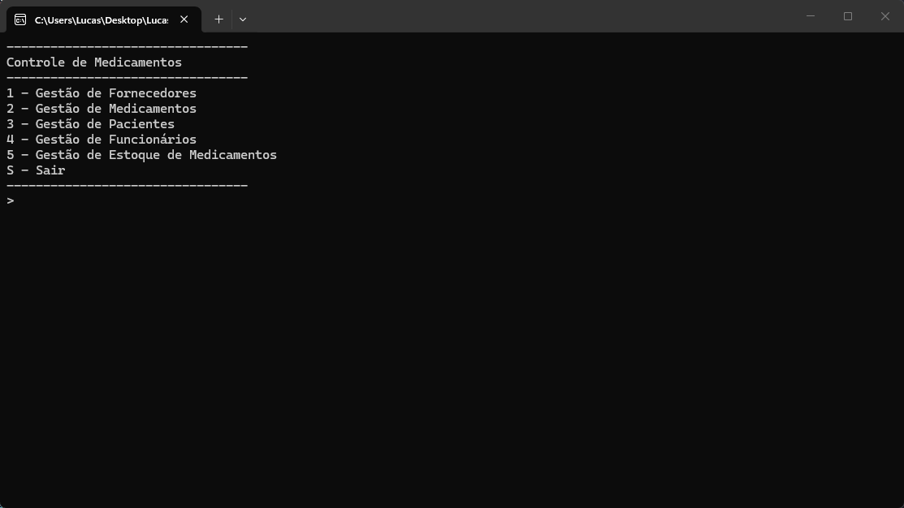

# Sistema de Controle de Medicamentos



## Sobre o projeto

Sistema desenvolvido para gerenciamento de medicamentos, fornecedores, pacientes, funcionários e movimentações de estoque.

O objetivo do projeto é controlar a entrada e saída de medicamentos, mantendo o estoque atualizado e garantindo a integridade das informações através de validações de negócio.

## Funcionalidades

### Fornecedores
- Cadastro de fornecedores
- Listagem de fornecedores
- Edição de fornecedores
- Exclusão de fornecedores

**Validações**
- Nome entre 3 e 100 caracteres
- Telefone em formato válido
- CNPJ com 14 dígitos
- Não permite fornecedores com CNPJ duplicado

---

### Medicamentos
- Cadastro de medicamentos
- Listagem de medicamentos
- Edição de medicamentos
- Exclusão de medicamentos

**Validações**
- Nome entre 3 e 100 caracteres
- Descrição entre 5 e 255 caracteres
- Quantidade em estoque maior que zero
- Fornecedor obrigatório

**Regras de negócio**
- Medicamentos com menos de 20 unidades são marcados como **Em Falta**
- Caso um medicamento já exista, sua quantidade em estoque é atualizada

---

### Pacientes
- Cadastro de pacientes
- Listagem de pacientes
- Edição de pacientes
- Exclusão de pacientes

**Validações**
- Nome entre 3 e 100 caracteres
- Telefone válido
- Cartão SUS com 15 dígitos
- CPF com 11 dígitos
- Não permite pacientes com mesmo Cartão SUS

---

### Funcionários
- Cadastro de funcionários
- Listagem de funcionários
- Edição de funcionários
- Exclusão de funcionários

**Validações**
- Nome entre 3 e 100 caracteres
- Telefone válido
- CPF com 11 dígitos
- Não permite funcionários com CPF duplicado

---

### Controle de Estoque

#### Entrada de Medicamentos
- Registro de entradas
- Histórico de entradas

**Validações**
- Data válida
- Medicamento obrigatório
- Funcionário obrigatório
- Quantidade positiva

**Regra de negócio**
- Atualiza automaticamente o estoque após registrar a entrada.

#### Saída de Medicamentos
- Registro de saídas
- Histórico de saídas

**Validações**
- Data válida
- Paciente obrigatório
- Medicamentos obrigatórios

**Regras de negócio**
- Não permite retirar quantidade superior ao estoque disponível.
- Atualiza automaticamente o estoque após registrar a saída.

---


## Tecnologias

- C#
- .NET
- Programação Orientada a Objetos (POO)
- Persistência em arquivos
- Arquitetura em camadas
- CRUD completo
- Validações de regras de negócio

## Regras Gerais

- Todos os campos obrigatórios são validados.
- Não é permitido cadastro de registros duplicados conforme CPF, CNPJ ou Cartão SUS.
- O estoque é atualizado automaticamente nas movimentações.
- O sistema impede saídas com estoque insuficiente.
- Medicamentos com estoque inferior a 20 unidades são identificados como **Em Falta**.

## Objetivo

Este projeto foi desenvolvido para praticar conceitos de desenvolvimento de software utilizando C#, como:

- Programação Orientada a Objetos
- Encapsulamento
- Herança
- Interfaces
- Separação em camadas
- Persistência de dados
- Implementação de regras de negócio
- Operações CRUD

## Como utilizar

1. Clone o repositório ou baixe o código fonte.
2. Abra o terminal ou o prompt de comando e navegue até a pasta raiz
3. Utilize o comando abaixo para restaurar as dependências do projeto.

   ```bash
   dotnet restore
   ```

4. Para executar o projeto compilando em tempo real

   ```bash
   dotnet run --project ControleDeMedicamentos.ConsoleApp
   ```

## Requisitos

- .NET 10.0 SDK
